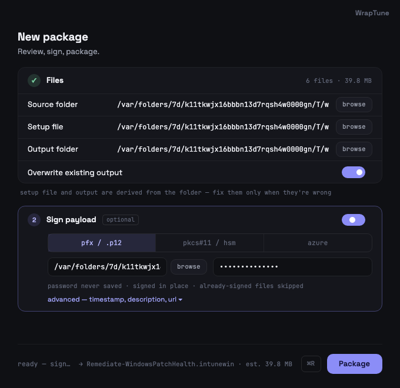
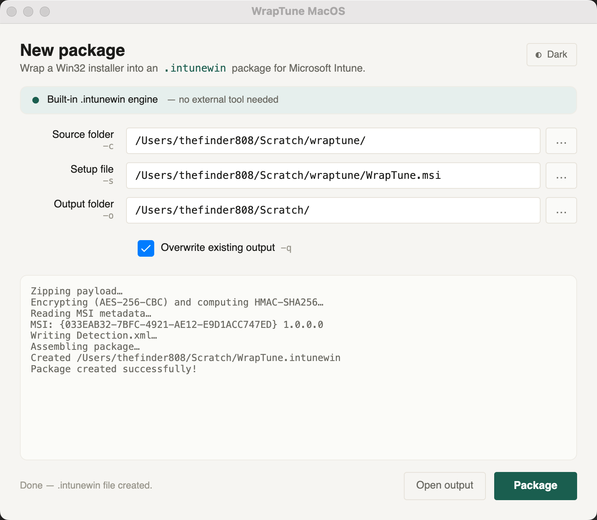

# WrapTune MacOS

Build Microsoft Intune **`.intunewin`** Win32 app packages natively on a Mac — no
Windows VM, no Wine, no official tooling required.

WrapTune MacOS is the macOS-native companion to
[WrapTune](https://github.com/thefinder808/WrapTune) (the Windows app). It's for
the **Mac-based admin who manages Windows fleets** and wants to wrap installers
into `.intunewin` packages without leaving macOS.

> The packages this produces deploy to **Windows** endpoints through Intune. This
> app builds them from a Mac — it doesn't change what they target.



## Why this exists

Microsoft's official `IntuneWinAppUtil.exe` (the Win32 Content Prep Tool) is a
closed-source, **.NET Framework**, **Windows-only** binary. It cannot run on
macOS, so the usual Mac options are a Windows VM or skipping local packaging
entirely.

WrapTune MacOS instead ships its **own clean-room implementation** of the
documented `.intunewin` format. The package layout, encryption, and metadata are
produced directly:

- **AES-256-CBC** payload encryption + **HMAC-SHA256** integrity, with a distinct
  MAC key, using only the .NET base-class-library cryptography — **no third-party
  dependency produces the encrypted artifact** (deliberate, for auditability and
  supply-chain safety).
- A hand-written **OLE2 / MSI Property-table reader** so MSI metadata
  (product/upgrade/package codes, version, publisher, install context) is
  extracted on macOS without any Windows Installer APIs.
- A `Detection.xml` that matches the shape Intune's client expects.

The result has been **deployed to a real Intune tenant and installed on Windows
endpoints** (Zoom, Chrome Enterprise, PowerShell 7), with the official tool
nowhere in the chain.

## Features

- Wrap `.exe`, `.msi`, `.ps1`, `.cmd`, `.bat` installers into `.intunewin`.
- Automatic **MSI metadata** extraction, including install context
  (per-machine / per-user / dual-purpose) derived from the MSI's `ALLUSERS`
  property — the value Intune uses for the app's install behavior.
- Drag-and-drop for the source folder and setup file.
- **Optional Authenticode code-signing** of the payload before wrapping — sign
  your `.exe`/`.msi`/`.ps1` from the Mac with a local cert (PFX or PKCS#11/HSM) or
  **Azure Artifact Signing** — formerly Trusted Signing. Signing runs in-process;
  nothing extra to install. See [Signing the payload](#signing-the-payload-optional).
- Light / dark theme.
- **In-app auto-updates** — checks GitHub Releases on launch (once a day) and from
  **Help → Check for Updates…**, then one-click download → verify → install → relaunch.
  Only a notarized, Developer-ID-signed build is ever installed.
- Signed **and notarized** universal release (Apple Silicon + Intel).



## Install

Download the latest signed, notarized `.dmg` for your Mac from the
[**Releases**](https://github.com/thefinder808/WrapTune-MacOS/releases) page:

- Apple Silicon → `WrapTuneMacOS-<version>-osx-arm64.dmg`
- Intel → `WrapTuneMacOS-<version>-osx-x64.dmg`

Open the `.dmg`, drag **WrapTune MacOS** to Applications, and launch. Because the
build is notarized, Gatekeeper accepts it without the right-click-Open workaround.

## Usage

1. **Source folder** — the folder containing your installer and any supporting files.
2. **Setup file** — the installer within that folder (`.exe`, `.msi`, `.ps1`, …).
3. **Output folder** — where the `.intunewin` is written.
4. Click **Package**, then upload the result in the Intune admin center as a
   **Windows app (Win32)**.

For `.msi` setup files, the package includes the MSI metadata Intune reads to
pre-fill the product code (e.g. the uninstall command) and the install behavior.

## Signing the payload (optional)

Wrapping into `.intunewin` is *encryption*, not a publisher signature. If your
fleet requires **Authenticode-signed** code (Verified Publisher, no SmartScreen
block, WDAC/AppLocker "signed only" policies), WrapTune can sign the payload —
your `.exe`/`.msi`/`.ps1` — **before** it's wrapped, in one pass.

This is a clean-room-friendly add-on: signing runs entirely **outside** the
`.intunewin` engine (which stays zero-dependency and pure-managed), powered by the
[MacSign signing engine](https://github.com/thefinder808/macsign) (Apache-2.0,
same author) — a cross-platform Authenticode implementation whose releases are
cross-verified by Windows `signtool` in CI. It runs **in-process**: no
`osslsigncode`, no `jsign`, no JVM to install.

Open the **Code signing — optional** section and enable signing:

- **PFX / .p12** — point at a `.pfx` file and enter its password (for self-signed,
  test, or legacy certificates).
- **PKCS#11 token / HSM** — point at the vendor's PKCS#11 module and enter the PIN
  (the form modern public OV/EV certificates take); the key never leaves the token.
- **Azure Artifact Signing** (formerly Trusted Signing) — enter your endpoint, account,
  and certificate profile. The short-lived access token is fetched automatically via the
  Azure CLI (`az login`), or you can paste one. Timestamping always happens (Microsoft's
  TSA by default). Your Azure identity needs the **"Artifact Signing Certificate Profile
  Signer"** role on the account, or signing returns 403.
- Optional **RFC3161 timestamp URL** (PFX/PKCS#11 modes) so signatures stay valid
  after the cert expires.

Notes: the password/PIN/token is **entered each run and never saved**; files are
signed **in place** in the source folder; and files that already carry a signature
are **skipped** (so vendor-signed installers are never clobbered). Plain `.cmd`/`.bat`
scripts can't be Authenticode-signed and are excluded. Full details:
[`docs/PAYLOAD-SIGNING.md`](docs/PAYLOAD-SIGNING.md).

## How it differs from the Windows WrapTune

The macOS window is intentionally simpler: there's **no "IntuneWinAppUtil.exe
path"** field (the engine is built in) and **no Catalog folder** field (the
official tool's `-a` Win10-S-mode catalog signing isn't reimplemented). Fields:
Source folder, Setup file, Output folder, Overwrite, theme toggle, Package,
output log — plus an optional **Code signing** section (see above) that the
Windows tool delegates to a separate signing step.

## Verifying a package

`tools/verify-intunewin.py` is an **independent** verifier that re-derives every
value Intune's client checks — container shape, `Detection.xml` fields, key
sizes, blob layout, HMAC, AES decryption, digest, size, and that the payload zip
contains the setup file — using code paths that share nothing with the engine
(Python standard library + `openssl`). It exits non-zero on any failure.

```bash
python3 tools/verify-intunewin.py path/to/package.intunewin
```

This proves format and cryptographic correctness. A real tenant upload remains
the authoritative check for tenant-side rules.

## Build from source

Requires the **.NET 10 SDK**.

```bash
# Run the engine's test suite
dotnet test

# Build a local .app + .dmg (unsigned is fine for development)
./build-macos.sh                 # Apple Silicon (osx-arm64)
RID=osx-x64 ./build-macos.sh     # Intel
```

Releasing (signing + notarization) is tag-driven via GitHub Actions; see
[`docs/RELEASE-SIGNING.md`](docs/RELEASE-SIGNING.md).

## Project layout

```
src/WrapTuneMacOS.Packaging   The .intunewin engine (class library, no UI)
src/WrapTuneMacOS.Signing     Optional payload Authenticode signing (in-process MacSign engine)
src/WrapTuneMacOS             Avalonia desktop UI
tests/                        Engine + signing validation (round-trip, golden, MSI, sign-then-wrap)
tools/verify-intunewin.py     Independent package verifier
build-macos.sh                publish → .app → sign → .dmg → notarize
```

## Support

If WrapTune saves you from spinning up a Windows VM, you can
[**buy me a coffee**](https://www.buymeacoffee.com/thefinder808). ☕

## License

[MIT](LICENSE)
